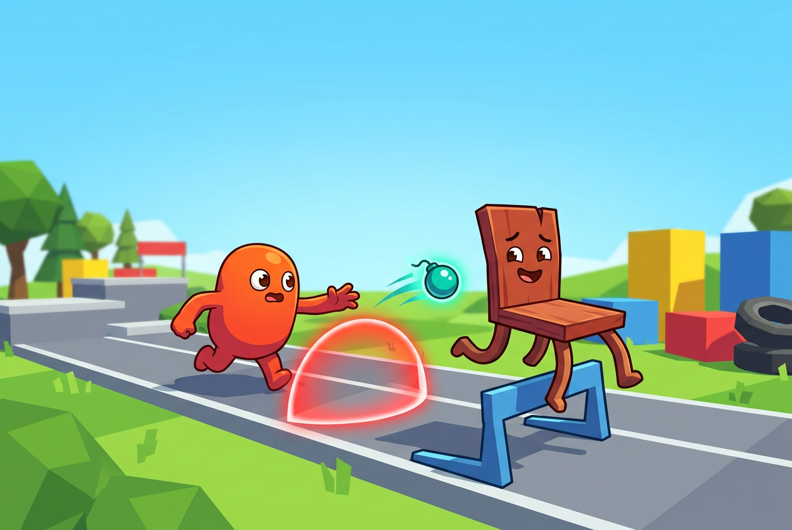

# 椅子大逃亡 2

<p align="center">
  
</p>

<p align="center">
  一款使用 Godot 4 制作的 3D 跑酷追逐游戏：扮演躲藏者翻越障碍、拾取道具并拖延时间，或成为追逐者主动出击抓住对手。
</p>

## 游戏特色

- **1 对 1 非对称追逐**：躲藏者擅长利用路线与道具周旋，追逐者拥有更高的基础速度。
- **跑酷移动**：支持跳跃、空中控制、自动跨越小台阶，以及面对低矮障碍时的翻越。
- **两种胜利规则**：限时躲藏与减速弹命中获胜。
- **单人、观战和双人联机**：可与 AI 对战、观看 AI 自战，或通过局域网与好友对战。
- **第一/第三人称视角**：可在开始游戏前选择。
- **10 张官方地图**：从训练竞技场、冬日小镇到下界要塞与恐怖旅馆。
- **角色皮肤**：内置多种皮肤，并支持导入 PNG、JPG 或 WEBP 图片作为自定义皮肤。

## 游戏玩法

每局由一名 **躲藏者（Runner）** 和一名 **追逐者（Tagger）** 组成。

### 躲藏者

你的目标是利用障碍、楼层、高低差和道具与追逐者周旋。

- 躲避追逐者的近距离抓捕。
- 拾取并投掷 **减速弹**：命中后会让追逐者短暂减速，且减速期间无法抓捕。
- 拾取并使用 **加速剂**：获得短时间移动加速。
- 在“命中获胜”规则中，减速弹达到指定命中次数即可获胜。
- 在任意规则中，坚持到倒计时结束也可获胜。
- 掉出地图会直接失败，请谨慎选择高风险捷径。

### 追逐者

你的目标是在时间耗尽前接近并抓住躲藏者。

- 基础速度比躲藏者更快。
- 抓捕不是碰到即成功：需要在近距离内朝向目标，并主动使用抓捕攻击。
- 墙体会阻挡抓捕，较大的垂直高度差也会使攻击失效。
- 拾取并使用 **透视卡**：短时间显示躲藏者的位置与穿墙轮廓。
- 被减速弹命中时暂时无法抓捕，应调整路线并等待效果结束。

## 胜利规则

### 限时躲藏

- 躲藏者坚持到倒计时结束：**躲藏者胜利**。
- 追逐者在倒计时结束前抓到躲藏者：**追逐者胜利**。
- 躲藏者掉出地图：**追逐者胜利**。

### 命中获胜

- 躲藏者用减速弹达到指定命中次数：**躲藏者胜利**。
- 躲藏者坚持到倒计时结束：**躲藏者胜利**。
- 追逐者提前抓到躲藏者，或躲藏者掉出地图：**追逐者胜利**。

命中目标、回合时长、地图、皮肤和视角可在开始游戏前配置。

## 新手教程

### 通用操作

| 操作 | 按键 |
|---|---|
| 移动 | `WASD` 或方向键 |
| 调整视角 | 移动鼠标 |
| 跳跃 / 面向低障碍时翻越 | `Space` |
| 拾取附近的身份道具 | `F` |
| 释放/捕获鼠标 | `Esc` |
| 重新开始本局 | 连按两次 `R` |
| 返回标题或房间 | 连按两次 `Q` |

### 躲藏者操作

| 操作 | 按键 |
|---|---|
| 投掷已携带的减速弹 | 鼠标左键 |
| 使用已携带的加速剂 | `E` |

**推荐路线：**

1. 开局先观察追逐者方向和附近道具。
2. 沿障碍较多、转角较密集的路线移动，利用追逐者转向损失拉开距离。
3. 面对低矮障碍时保持前进并按 `Space`，触发翻越，而不是绕路。
4. 使用 `F` 拾取减速弹或加速剂；同类槽位已满时不能继续拾取。
5. 投掷减速弹后立即切换路线；命中产生的减速窗口适合上楼、跳台或寻找下一件道具。
6. 不要只盯着追逐者，注意平台边缘——躲藏者掉出地图会立即失败。

### 追逐者操作

| 操作 | 按键 |
|---|---|
| 发动近距离抓捕 | 鼠标左键 |
| 使用已携带的透视卡 | `E` |

**推荐路线：**

1. 不要始终沿躲藏者的脚印追赶，尝试利用更高速度从转角或捷径截断路线。
2. 进入近距离后先对准目标，再按鼠标左键；隔墙、背对目标或高度差过大都会抓空。
3. 抓捕有冷却时间，避免在目标尚未进入范围时浪费攻击。
4. 使用 `F` 拾取透视卡，在迷宫、楼层复杂或丢失视野时按 `E` 使用。
5. 被减速弹命中后无法抓捕，优先保持目标视野并预判其下一条路线。

### HUD 提示

- 左上角显示当前规则和角色坐标。
- 顶部显示剩余时间；命中模式还会显示当前命中进度。
- 小地图会显示自己、可拾取道具和满足可见条件的对手。
- 对手离开视野后，小地图会短暂保留其最后位置。
- 躲藏者附近出现红色威胁效果时，说明追逐者已经非常接近。
- 追逐者界面会显示抓捕是否就绪、正在冷却，或是否因减速而禁用。

## 游戏模式

| 模式 | 说明 |
|---|---|
| 躲藏者 VS AI 追逐者 | 玩家扮演躲藏者，与 AI 追逐者对战 |
| 追逐者 VS AI 躲藏者 | 玩家扮演追逐者，抓捕 AI 躲藏者 |
| AI VS AI 观战 | 自动摄像机观看双方 AI 对战 |
| 双人联机 | 一名房主和一名加入者进行 1 对 1 对战 |

联机对局结算后会返回房间，并自动交换追逐者与躲藏者身份。

## 双人联机教程

游戏使用 ENet，默认端口为 **`24591`**，每个房间支持一名房主和一名加入者。

### 同一台电脑测试

1. 双击 `启动双客户端.bat`。
2. 第一个窗口选择“创建联机房间”。
3. 第二个窗口在 IP 输入框填写 `127.0.0.1`。
4. 点击“加入联机房间”。
5. 双方进入房间后可切换角色；由房主选择规则、地图和视角并开始游戏。

### 局域网联机

1. 房主选择“创建联机房间”。
2. 房主在 Windows 中运行 `ipconfig`，找到当前网络的 IPv4 地址，例如 `192.168.1.23`。
3. 加入者在 IP 输入框填写房主的 IPv4 地址，然后点击“加入联机房间”。
4. 如果连接失败，请确认：
   - 两台设备位于同一局域网；
   - 房主已经创建房间；
   - Windows 防火墙允许游戏或 Godot 通信；
   - UDP 端口 `24591` 未被占用或拦截。

> 当前房间为 1 对 1。房主负责同步地图、角色、规则和视角设置。

## 官方地图

- 默认跑酷竞技场
- 圆环障碍训练场
- 双层别墅追逐战
- 林地废墟
- 沙漠神殿
- 森林小岛（外海 + 内湖）
- 下界要塞
- 冬日小镇
- 城市训练工地
- 猴子旅馆走廊

希望制作自己的地图？请阅读 [自定义地图制作指南](自定义地图制作指南.md)。

## 隐藏菜单与彩蛋

<details>
<summary><strong>点击展开（包含隐藏内容与彩蛋剧透）</strong></summary>

### 篮球终结模式

这是藏在联机 IP 输入框中的单人彩蛋模式。

1. 回到游戏主菜单。
2. 在“输入房主 IP”的输入框中填写：`0721`。
3. 点击“加入联机房间”，或直接按回车提交。
4. 游戏不会尝试联网，而会启动“篮球终结模式”。

该模式下玩家扮演躲藏者，与 AI 追逐者对战。追逐者成功抓住躲藏者时，会触发专属的第三人称篮球终结动画：追逐者举起躲藏者，将其投进临时出现的篮筐。

### 调试显示

按 `F3` 可切换 Debug Mode：

- 显示或隐藏地图和角色的碰撞箱；
- 配合左上角坐标信息检查地图碰撞与出生位置；
- 在标题界面切换时会显示当前 Debug Mode 状态。

该功能主要供地图制作者和开发调试使用，不会改变胜负规则。

</details>

## 运行项目

### 环境要求

- Windows 10/11 x86_64
- Godot **4.7.1 Stable**（项目特性为 Godot 4.7 / Forward Plus）

### 方法一：启动脚本

1. 下载并解压项目。
2. 安装 Godot 4.7.1，或将 `Godot_v4.7.1-stable_win64.exe` 放到项目根目录。
3. 双击 `启动游戏.bat`。

启动脚本也会尝试从系统 `PATH`、下载目录和桌面查找 Godot。

### 方法二：Godot 编辑器

1. 打开 Godot 项目管理器。
2. 导入项目根目录下的 `project.godot`。
3. 等待资源导入完成。
4. 按 `F6`/`F5` 运行主场景或整个项目。

### 方法三：命令行

```powershell
godot4 --path .
```

如果可执行文件名不同，请将 `godot4` 替换为实际路径。

## 项目结构

```text
assets/        音频、标题图和投掷物资源
maps/          官方地图 JSON、贴图和地图模型
rl/            强化学习相关资源
scenes/        Godot 场景
scripts/       游戏、角色、AI、联机与着色器代码
skins/         内置角色皮肤及其配置
project.godot  Godot 项目入口
```

## 技术信息

- 引擎：Godot 4.7 / Forward Plus
- 推荐开发版本：Godot 4.7.1 Stable
- 当前游戏内版本：v1.6.1
- 联机：Godot ENet，UDP `24591`
- 主场景：`scenes/main.tscn`

## 资源说明

减速弹与加速剂模型来自 Quaternius / Poly Pizza，采用 CC0 1.0；透视卡为项目内制作的模型。
